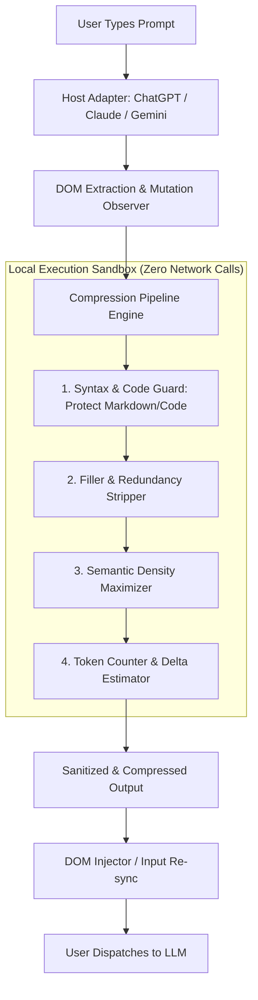

# Architecture & Technical Design

## Overview
`brevity-prompt` is a client-side Chrome extension designed to eliminate token waste and latency in large language model (LLM) interactions. It intercepts and compresses prompt context directly within the browser before API transmission.



---

## Architectural Decision Records (ADRs)

### ADR-001: 100% Client-Side In-Browser Processing
* **Status**: Accepted
* **Context**: User prompts frequently contain proprietary code, credentials, or confidential business data.
* **Decision**: All regex parsing, AST transformations, and token approximations run exclusively in client-side memory. Zero analytics, zero logging endpoints, zero third-party telemetry.
* **Consequences**: Absolute data privacy; strictly zero server infrastructure cost.

### ADR-002: Adapter Pattern for Dynamic Chat Interfaces
* **Status**: Accepted
* **Context**: ChatGPT, Claude, and Gemini frequently update their DOM structures and `contenteditable` implementations.
* **Decision**: Implement a decoupled `BaseChatAdapter` class with polymorphic implementations (`ChatGPTAdapter`, `ClaudeAdapter`, `GeminiAdapter`).
* **Consequences**: Isolates platform-specific selector mutations. Adding support for new LLM UIs requires only implementing one new adapter file.

### ADR-003: Non-Destructive Code Block Shielding
* **Status**: Accepted
* **Context**: Aggressive token compression must never mutate programming code, SQL queries, or JSON schemas.
* **Decision**: Extract fenced code blocks (` ``` `) and inline literals (` ` `) into temporary hashes before natural language compression, re-injecting them intact at final assembly.
* **Consequences**: 100% syntactical code preservation while achieving 40-65% token reductions on conversational wrapper prose.
